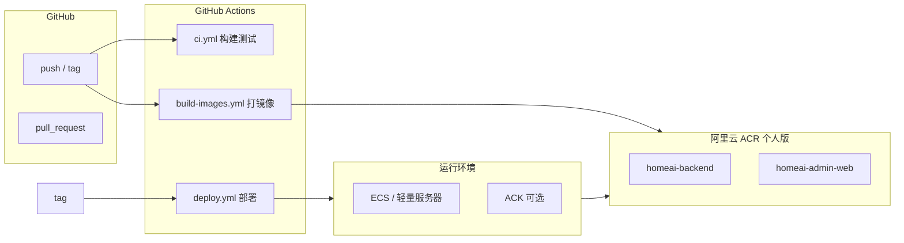

# GitHub Actions + 阿里云 ACR CI/CD 方案

> **文档状态：已实施（待上线验证）**  
> Workflow 与 `JeecgBoot/deploy/` 部署文件已创建。上线前请在 GitHub 配置 Secrets，并在 ECS 完成首次初始化（见 `JeecgBoot/deploy/setup-ecs.md`）。

## 已确认决策（2026-08-07）

| # | 决策项 | 结论 |
|---|--------|------|
| 1 | 部署目标 | **单机阿里云 ECS**，与 ACR 同地域 |
| 2 | 地域 | **cn-hangzhou**（杭州） |
| 3 | 中间件 | **MySQL + Redis** 同机 Docker Compose 部署（含 pgvector 可选组件） |
| 4 | 域名 | **管理端与 API 同域名**，Nginx `/jeecgboot` 反代 |
| 5 | 分支模型 | **`main`** CI；**`dev`** / **`prd`** 构建推 ACR |
| 6 | ACR | 命名空间 **`liulm`**；镜像 **`homeai-backend`**、**`homeai-admin-web`** |
| 7 | 部署方式 | GitHub 仅推后端镜像；管理端在 ECS 本机构建 + Nginx 部署 |

**实施产物路径**

| 文件 | 说明 |
|------|------|
| `.github/workflows/ci.yml` | main / PR 编译验证 |
| `.github/workflows/build-push-dev.yml` | dev 后端 CI |
| `.github/workflows/build-push-prd.yml` | prd 后端 CI |
| `JeecgBoot/deploy/frontend-nginx/` | Nginx 管理端部署 |
| `JeecgBoot/deploy/README.md` | 部署总览（二选一） |
| `JeecgBoot/jeecgboot-vue3/.env.docker.prod` | 同域 API 构建配置 |
| `JeecgBoot/deploy/setup-ecs.md` | ECS 首次部署步骤 |
| `JeecgBoot/deploy/GITHUB_SECRETS.md` | Secrets 清单 |

---

**相关路径**

| 领域 | 路径 |
|------|------|
| 单体 compose | `JeecgBoot/docker-compose.yml` |
| 后端 Dockerfile | `JeecgBoot/jeecg-boot/jeecg-module-system/jeecg-system-start/Dockerfile` |
| 前端 Dockerfile | `JeecgBoot/jeecgboot-vue3/Dockerfile` |
| Docker Profile | `.../application-docker.yml` |
| HomeAI 模块 | `JeecgBoot/jeecg-boot/jeecg-boot-module/jeecg-boot-module-homeai/` |
| DB 初始化 | `scripts/init-db.sh` |
| 小程序（非容器主路径） | `JeecgUniapp/` |

---

## 1. 目标与范围

### 1.1 目标

| 目标 | 说明 |
|------|------|
| **自动化构建** | push/PR/tag 触发 Maven、pnpm 构建 |
| **镜像标准化** | 产出可复现 Docker 镜像，推送 ACR |
| **环境一致** | dev/staging/prod 通过 tag + 配置区分 |
| **安全** | 密钥仅存 GitHub Secrets，不入库 |
| **可回滚** | 镜像按版本 tag 保留，部署可回退 |

### 1.2 范围（本期）

| 纳入 CI/CD | 不纳入（另议） |
|------------|----------------|
| 后端 `jeecg-system-start`（含 homeai 模块） | 微服务栈（Nacos/Gateway，且 cloud 不含 homeai） |
| 管理端 `jeecgboot-vue3` Nginx 镜像 | JeecgUniapp 微信小程序包（走微信 CI 或手动） |
| 推送阿里云个人版 ACR | MySQL/Redis 托管或自建（用云产品或 compose，不每次 CI 构建） |

### 1.3 推荐部署形态

**单体 2 镜像 + 托管中间件**（与现有 `docker-compose.yml` 一致）：

```
[用户] → jeecgboot-vue3(Nginx:80) → jeecg-boot-system:8080
                                      ↓
                              MySQL + Redis（RDS/自建）
                              （可选 pgvector）
```

---

## 2. 现状与缺口

### 2.1 已有资产

- 后端/前端 **Dockerfile 已存在**，基础镜像已用阿里云 mirror
- `docker-compose.yml` 可本地一键编排
- Maven `-Pdocker` profile → `application-docker.yml`
- 前端 `pnpm build:docker` + `.env.docker`

### 2.2 缺口（实施 CI/CD 需补齐）

| 缺口 | 处理建议 |
|------|----------|
| 无 `.github/workflows/` | 新建 workflow |
| Dockerfile **非多阶段**，需先 build 再 docker build | CI 分步构建，或改 multi-stage Dockerfile |
| JAR 名硬编码 `jeecg-system-start-3.9.3.jar` | CI 用变量或改 Dockerfile ARG |
| HomeAI SQL 不在 MySQL 镜像 init 中 | 部署后跑 `scripts/init-db.sh` 或引入 Flyway |
| `init-db.sh` 库名 `jeecg` vs docker `jeecg-boot` | 统一为 `jeecg-boot` |
| HomeAI 敏感配置（OSS/JWT/微信） | 运行时环境变量或 K8s Secret |
| 后端 `sleep 60` 启动 | 生产改为 healthcheck + `depends_on: condition` |
| 无部署 workflow | Phase 2 增加 SSH/ACK 滚动更新 |

---

## 3. 总体架构



### 3.1 镜像命名规范

```
{registry}/{namespace}/{image}:{tag}
```

示例（个人版 ACR）：

```
registry.cn-hangzhou.aliyuncs.com/your-namespace/homeai-backend:3.9.3
registry.cn-hangzhou.aliyuncs.com/your-namespace/homeai-backend:sha-a1b2c3d
registry.cn-hangzhou.aliyuncs.com/your-namespace/homeai-backend:latest
registry.cn-hangzhou.aliyuncs.com/your-namespace/homeai-admin-web:3.9.3
```

**Tag 策略**

| Tag | 触发 | 用途 |
|-----|------|------|
| `sha-{7位commit}` | 每次 push main | 可追溯、回滚 |
| `{version}` | 打 git tag `v*` | 正式发布 |
| `latest` | main 分支成功构建 | 测试/开发拉取（生产慎用） |
| `pr-{number}` | PR 构建（可选，不推送或推私有） | 预览 |

---

## 4. Workflow 设计

### 4.1 文件规划

```
.github/
└── workflows/
    ├── ci.yml                 # PR / push：编译测试，不推镜像
    ├── build-backend.yml      # 后端镜像 → ACR
    ├── build-admin-web.yml    # 管理端镜像 → ACR
    ├── build-images.yml       # 可选：统一编排 backend+web
    └── deploy.yml             # 手动/ tag 触发部署
```

### 4.2 `ci.yml` — 持续集成（每次 PR / push）

**目的**：快速反馈，不产生镜像或仅缓存依赖。

| Job | 步骤 |
|-----|------|
| `backend` | JDK 17 → `mvn -pl jeecg-module-system/jeecg-system-start -am verify`（或 `package -DskipTests`） |
| `admin-web` | Node 20 + pnpm 9 → `pnpm install --frozen-lockfile` → `pnpm typecheck`（若有）→ `pnpm build` |
| `uniapp`（可选） | Node 20 → `pnpm build:mp-weixin` 仅验证能编过 |

**触发**：`pull_request`、`push` 到 `main`/`develop`

**不推送 ACR**，控制个人版配额与费用。

### 4.3 `build-backend.yml` — 后端镜像

**触发**：
- `push` → `main`：推 `sha-*` + `latest`
- `push` tag `v*`：推版本号
- `workflow_dispatch`：手动指定 tag

**步骤概要**：

```yaml
# 伪代码流程
1. checkout
2. setup-java 17 + Maven cache
3. mvn clean package -Pdocker -pl jeecg-module-system/jeecg-system-start -am -DskipTests
4. docker/login-action → ACR
5. docker/build-push-action
   context: JeecgBoot/jeecg-boot/jeecg-module-system/jeecg-system-start
   tags: ${{ env.ACR_REGISTRY }}/${{ env.ACR_NAMESPACE }}/homeai-backend:...
6. （可选）Trivy 镜像漏洞扫描
```

**构建命令（与线上一致）**：

```bash
cd JeecgBoot/jeecg-boot
mvn clean package -Pdocker \
  -pl jeecg-module-system/jeecg-system-start -am \
  -DskipTests
```

### 4.4 `build-admin-web.yml` — 管理端镜像

**步骤概要**：

```yaml
1. checkout
2. setup-node 20 + pnpm 9
3. cd JeecgBoot/jeecgboot-vue3
4. pnpm install --frozen-lockfile
5. pnpm run build:docker    # 使用 .env.docker 中 API 地址
6. docker build -f Dockerfile .
7. push ACR → homeai-admin-web:tag
```

**注意**：`.env.docker` 中 `VITE_GLOB_DOMAIN_URL` 需按环境区分：
- 构建时若 API 走同域 Nginx 反代，可用相对路径或生产域名
- 多环境建议：**构建参数注入** `VITE_GLOB_DOMAIN_URL`，避免把 dev 地址打进 prod 镜像

### 4.5 `build-images.yml`（可选合并）

单 workflow 内 `needs` 并行 backend + admin-web，统一版本 tag，保证同一 commit 两镜像版本一致。

### 4.6 `deploy.yml` — 部署（Phase 2）

**触发**：`workflow_dispatch` 或 `push` tag `v*`

**部署方式（三选一，见第 7 节）**：

| 方式 | 适用 |
|------|------|
| A. SSH + docker compose pull | 单机/轻量 ECS，最简单 |
| B. 阿里云 ACK | K8s 集群，滚动更新 |
| C. 仅推镜像，人工拉取 | 初期验证 |

---

## 5. 阿里云 ACR 个人版配置

### 5.1 开通与命名空间

1. 登录 [容器镜像服务 ACR](https://cr.console.aliyun.com/)
2. 选择 **个人版** 实例（地域建议与 ECS 同区，如 `cn-hangzhou`）
3. 创建命名空间，如 `homeai`
4. 创建仓库：
   - `homeai-backend`
   - `homeai-admin-web`

### 5.2 GitHub Secrets 清单

| Secret | 说明 | 示例 |
|--------|------|------|
| `ACR_REGISTRY` | 登录地址 | `registry.cn-hangzhou.aliyuncs.com` |
| `ACR_NAMESPACE` | 命名空间 | `homeai` |
| `ACR_USERNAME` | ACR 登录用户名 | 阿里云账号或 RAM 子账号 |
| `ACR_PASSWORD` | 登录密码 | 在 ACR 控制台设置固定密码 |

**推荐**：为 CI 单独建 **RAM 子账号**，仅授予 ACR 推送权限，不使用主账号 AccessKey。

**可选（部署阶段）**：

| Secret | 说明 |
|--------|------|
| `DEPLOY_SSH_HOST` | ECS 公网 IP |
| `DEPLOY_SSH_USER` | 如 `root` / `ubuntu` |
| `DEPLOY_SSH_KEY` | 私钥全文 |
| `DEPLOY_COMPOSE_PATH` | 服务器上 compose 目录 |

### 5.3 GitHub Actions 登录 ACR 示例

```yaml
- name: Login to ACR
  uses: docker/login-action@v3
  with:
    registry: ${{ secrets.ACR_REGISTRY }}
    username: ${{ secrets.ACR_USERNAME }}
    password: ${{ secrets.ACR_PASSWORD }}
```

个人版使用**固定密码**登录，非 Docker Hub 方式。

---

## 6. 镜像与 Dockerfile 改造建议

### 6.1 后端：建议改为 multi-stage（可选优化）

**现状**：CI 先 `mvn package`，Dockerfile 仅 `ADD target/*.jar`。

**建议**（减少 CI 步骤、版本不写死）：

```dockerfile
# stage 1: build
FROM maven:3.9-eclipse-temurin-17 AS builder
WORKDIR /build
COPY pom.xml .
COPY jeecg-boot-base-core jeecg-boot-base-core
# ... 按 layer 缓存复制模块
RUN mvn package -Pdocker -pl jeecg-module-system/jeecg-system-start -am -DskipTests

# stage 2: runtime
FROM registry.cn-hangzhou.aliyuncs.com/dockerhub_mirror/java:17-anolis
ARG JAR_FILE=jeecg-system-start-3.9.3.jar
COPY --from=builder /build/jeecg-module-system/jeecg-system-start/target/${JAR_FILE} /jeecg-boot/app.jar
CMD ["java", "-jar", "/jeecg-boot/app.jar"]
```

**短期**：不改 Dockerfile，CI 维持「Maven → docker build」两步。

### 6.2 前端：构建参数化 API 地址

```dockerfile
# 或在 CI 中 build 前 sed/envsubst
ARG VITE_GLOB_DOMAIN_URL=https://api.example.com/jeecg-boot
RUN pnpm build:docker
```

### 6.3 生产 compose 改造示例

服务器上 `docker-compose.prod.yml`（不提交密钥）：

```yaml
services:
  jeecg-boot-system:
    image: registry.cn-hangzhou.aliyuncs.com/homeai/homeai-backend:${IMAGE_TAG}
    environment:
      SPRING_PROFILES_ACTIVE: docker,prod
      # HomeAI / OSS 等通过 env_file 注入
    env_file: .env.prod
  jeecg-vue:
    image: registry.cn-hangzhou.aliyuncs.com/homeai/homeai-admin-web:${IMAGE_TAG}
    ports:
      - "80:80"
```

MySQL/Redis 建议使用 **阿里云 RDS + Redis 云版**，compose 中去掉本地 mysql/redis 服务。

---

## 7. 部署环境方案对比

| 方案 | 复杂度 | 成本 | 推荐阶段 |
|------|--------|------|----------|
| **A. ECS + docker compose pull** | 低 | 低 | MVP / 个人项目 |
| **B. ACK（K8s）** | 高 | 中 | 流量增长后 |
| **C. 函数计算/SAE** | 中 | 按量 | Spring Boot 需改造，不推荐首期 |

### 7.1 方案 A 部署流程（推荐首期）

1. ECS 安装 Docker + Docker Compose
2. 配置 `~/.docker/config.json` 或使用 `docker login`（deploy job SSH 执行）
3. 放置 `docker-compose.prod.yml` + `.env.prod`（不入库）
4. `deploy.yml` SSH 执行：

```bash
export IMAGE_TAG=v1.0.0
docker compose -f docker-compose.prod.yml pull
docker compose -f docker-compose.prod.yml up -d
```

5. 首次部署后执行 `scripts/init-db.sh` 初始化 HomeAI 表

### 7.2 健康检查（建议替换 sleep 60）

后端增加 Spring Actuator 或简单 HTTP 探针；compose：

```yaml
healthcheck:
  test: ["CMD", "curl", "-f", "http://localhost:8080/jeecg-boot/actuator/health"]
  interval: 30s
  timeout: 10s
  retries: 5
```

---

## 8. 分支与环境策略

| 分支/事件 | CI | 推 ACR | 部署目标 |
|-----------|-----|--------|----------|
| `feature/*` PR | ✅ verify | ❌ | — |
| `develop` push | ✅ | ✅ tag `dev-sha-*` | 测试 ECS（可选） |
| `main` push | ✅ | ✅ `sha-*` + `latest` | 预发（可选） |
| tag `v*.*.*` | ✅ | ✅ 版本 tag | **生产** |

**环境变量文件（不入库）**：

| 环境 | 后端配置 | 前端构建变量 |
|------|----------|--------------|
| dev | `application-dev.yml` + env | dev API URL |
| prod | `application-prod.yml` + env | 生产 API URL |

HomeAI 必填运行时配置（通过 env 或 K8s Secret 注入）：

- `homeai.ai.key-encryption-key`
- `homeai.jwt.secret`
- `homeai.wechat.appid` / `secret`（若仍用小程序）
- OSS AccessKey（或 RAM 角色，ECS 上更推荐 **实例 RAM 角色** 免密钥）

---

## 9. JeecgUniapp（小程序）CI 说明

小程序**不适合**与后端打同一镜像，建议独立 job：

| 步骤 | 说明 |
|------|------|
| `pnpm build:mp-weixin` | 产出 `dist/build/mp-weixin` |
| 上传 | 微信 miniprogram-ci / 人工开发者工具 |
| 环境 | `JeecgUniapp/env/.env.production` 中 API 指向 prod |

可选 workflow：`build-uniapp.yml`，仅 `workflow_dispatch`，artifacts 保留 7 天。

---

## 10. 安全与合规

| 项 | 要求 |
|----|------|
| Secrets | 仅 GitHub Secrets / 服务器 env_file，禁止写入镜像层 |
| ACR | 生产仓库可设「不可变 tag」；定期清理 `pr-*` |
| 镜像扫描 | 可选 Trivy / 阿里云镜像安全扫描 |
| 依赖 | 可选 Dependabot 更新 Actions 与 npm/Maven |
| 备案 | 公网 API/管理端域名需 ICP；与 [Android 迁移方案](../plan/android-migration-design.md) 一致 |

---

## 11. 实施阶段（恢复执行时参考）

### Phase 1：CI + 推镜像

- [x] 新增 `ci.yml`、`build-and-deploy-dev.yml`、`build-and-deploy-prd.yml`
- [x] 同域前端构建 `build:docker:prod` + `.env.docker.prod`
- [ ] 在 ACR 命名空间 `liulm` 创建 `homeai-backend`、`homeai-admin-web` 仓库
- [ ] 配置 GitHub Secrets（见 `JeecgBoot/deploy/GITHUB_SECRETS.md`）
- [ ] dev/prd 分支 push 验证 ACR 可见镜像

### Phase 2：部署自动化

- [x] `JeecgBoot/deploy/docker-compose.dev.yml` / `docker-compose.prd.yml`
- [x] 管理端方案分离：`frontend-docker/` 与 `frontend-nginx/`
- [x] Workflow 仅推送后端镜像；前端静态在服务器本机构建
- [ ] 配置 GitHub Secrets：`ACR_USERNAME`、`ACR_PASSWORD`
- [ ] ECS 首次初始化（`setup-ecs.md`）

### Phase 3：加固（约 1 周）

- [ ] multi-stage Dockerfile / JAR 版本 ARG 化
- [ ] 健康检查替代 sleep 60
- [ ] 镜像漏洞扫描
- [ ] 文档：`docs/deploy/setup-production-env-v1.md`

### Phase 4：扩展（可选）

- [ ] ACK + Helm
- [ ] JeecgUniapp 构建 artifact
- [ ] Flyway 管理 HomeAI SQL 迁移

---

## 12. 已确认决策（原待确认项）

上述 7 项决策已于 2026-08-07 确认并写入本文档顶部表格；实施细节见 `JeecgBoot/deploy/` 与 `.github/workflows/`。

---

## 13. 参考：最小 backend workflow 骨架

```yaml
name: Build Backend Image

on:
  push:
    branches: [main]
    tags: ['v*']
  workflow_dispatch:

env:
  IMAGE_NAME: homeai-backend

jobs:
  build:
    runs-on: ubuntu-latest
    steps:
      - uses: actions/checkout@v4

      - uses: actions/setup-java@v4
        with:
          distribution: temurin
          java-version: '17'
          cache: maven

      - name: Maven package
        working-directory: JeecgBoot/jeecg-boot
        run: mvn clean package -Pdocker -pl jeecg-module-system/jeecg-system-start -am -DskipTests

      - uses: docker/login-action@v3
        with:
          registry: ${{ secrets.ACR_REGISTRY }}
          username: ${{ secrets.ACR_USERNAME }}
          password: ${{ secrets.ACR_PASSWORD }}

      - uses: docker/build-push-action@v6
        with:
          context: JeecgBoot/jeecg-boot/jeecg-module-system/jeecg-system-start
          push: true
          tags: |
            ${{ secrets.ACR_REGISTRY }}/${{ secrets.ACR_NAMESPACE }}/${{ env.IMAGE_NAME }}:sha-${{ github.sha }}
            ${{ secrets.ACR_REGISTRY }}/${{ secrets.ACR_NAMESPACE }}/${{ env.IMAGE_NAME }}:latest
```

---

## 14. 变更记录

| 日期 | 版本 | 说明 |
|------|------|------|
| 2026-08-07 | v1 | 初版 CI/CD 方案（GitHub Actions + 阿里云 ACR 个人版） |
