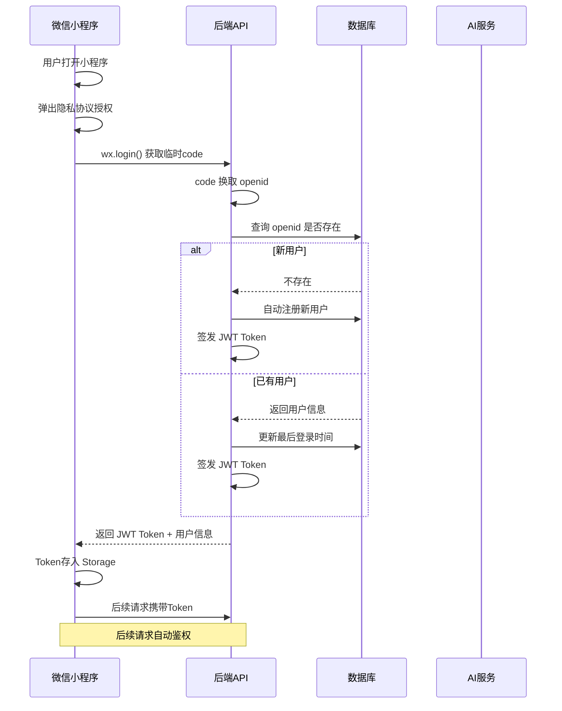
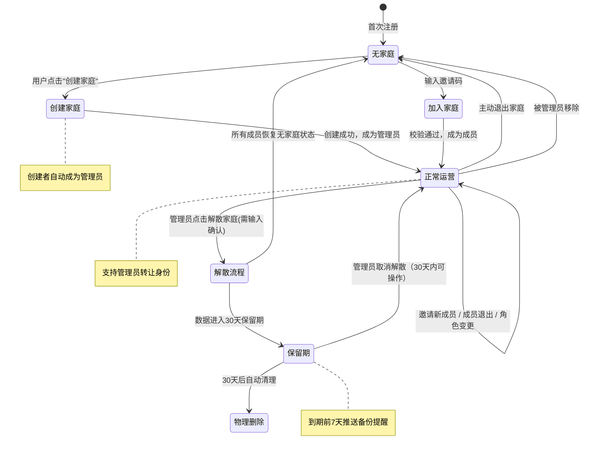
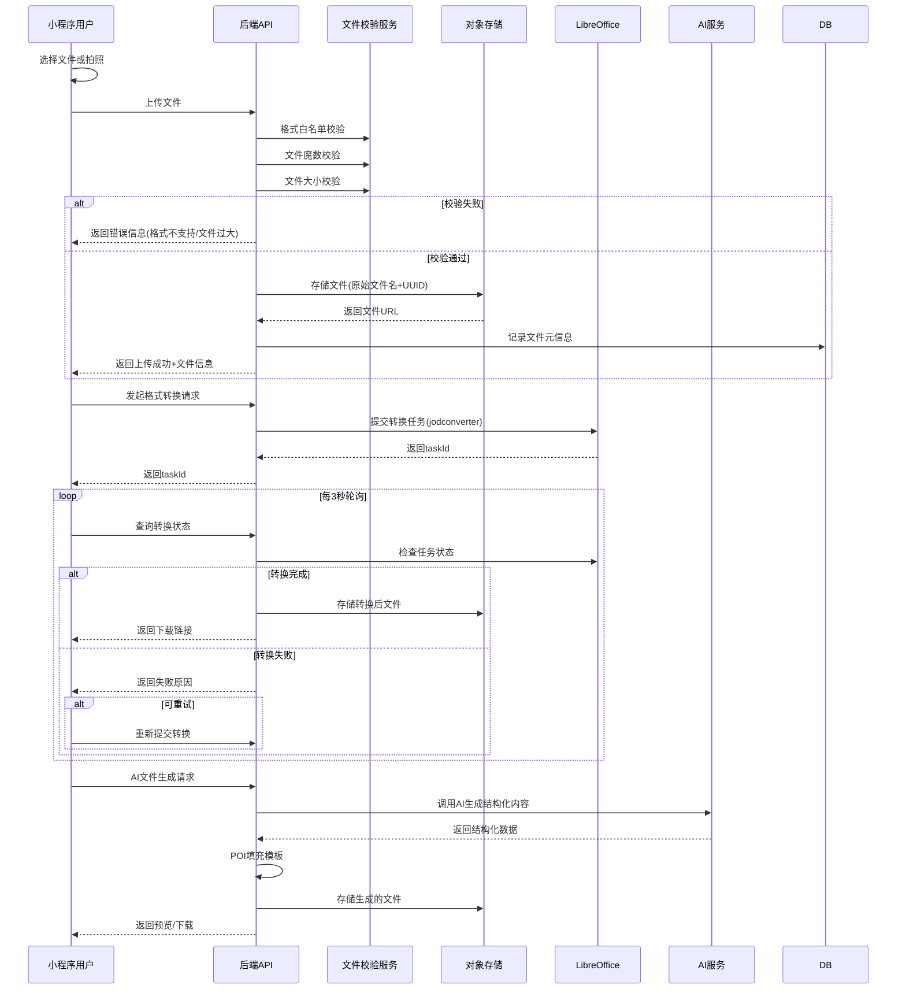
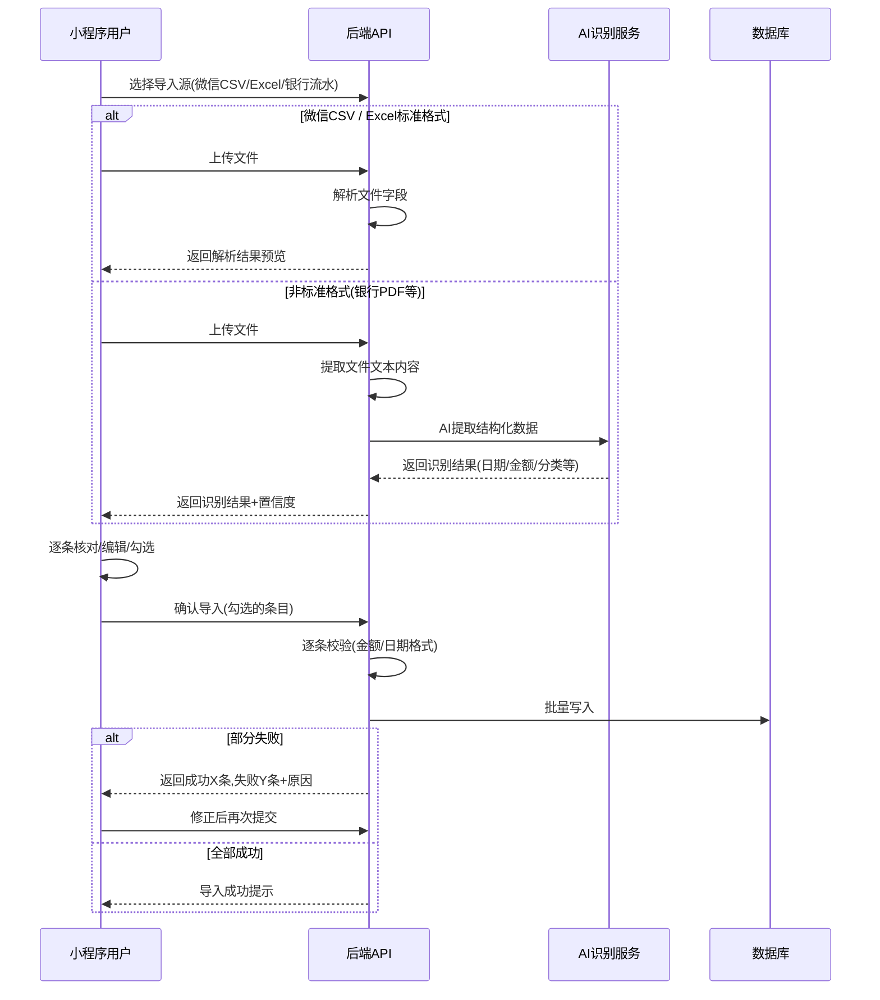
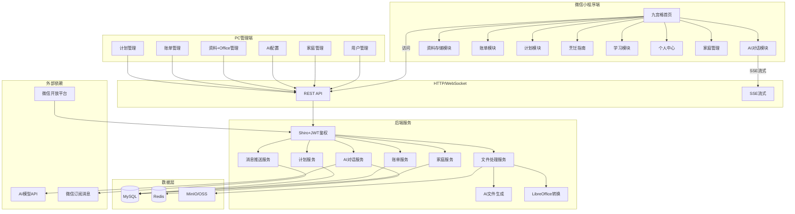
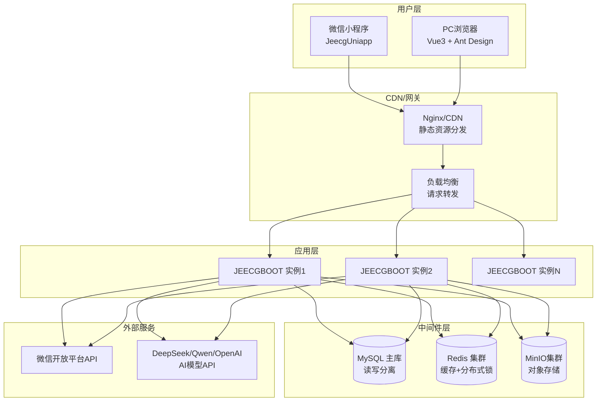

> 本文档摘自 [architecture-design.md](architecture-design.md) 拆分，内容同步 v8 版本

# 流程图与数据库设计

## 目录

- [十四、系统流程图](#十四系统流程图)
  - [14.1 用户登录与注册流程](#14.1-用户登录与注册流程)
  - [14.2 家庭生命周期流程](#14.2-家庭生命周期流程)
  - [14.3 文件上传与Office处理流程](#14.3-文件上传与office处理流程)
  - [14.4 账单导入与AI识别流程](#14.4-账单导入与ai识别流程)
  - [14.5 系统交互总览图](#14.5-系统交互总览图)
  - [14.6 部署架构图](#14.6-部署架构图)
- [十五、数据库设计](#十五数据库设计)
  - [15.1 数据表总览](#15.1-数据表总览)
  - [15.2 建表语句 (DDL)](#15.2-建表语句-(ddl))
  - [15.3 核心索引与约束汇总](#15.3-核心索引与约束汇总)
  - [15.4 实体关系总览 (ER图)](#15.4-实体关系总览-(er图))

---

## 十四、系统流程图

### 14.1 用户登录与注册流程



### 14.2 家庭生命周期流程



### 14.3 文件上传与Office处理流程



### 14.4 账单导入与AI识别流程



### 14.5 系统交互总览图



### 14.6 部署架构图




## 十五、数据库设计

### 15.1 数据表总览

| 模块 | 表名 | 说明 |
| ---- | ---- | ---- |
| 用户 | `homeai_wx_user` | 微信用户信息 |
| 家庭 | `homeai_family` | 家庭基本信息 |
| 家庭 | `homeai_family_member` | 家庭成员关联表 |
| 家庭 | `homeai_family_invite_code` | 邀请码记录 |
| AI对话 | `homeai_ai_key_config` | AI密钥配置 |
| AI对话 | `homeai_ai_conversation` | 对话主表 |
| AI对话 | `homeai_ai_message` | 对话消息表 |
| AI对话 | `homeai_ai_quota_log` | Token额度消耗日志 |
| 资料存储 | `homeai_storage_folder` | 文件夹 |
| 资料存储 | `homeai_storage_file` | 文件记录 |
| 资料存储 | `homeai_office_convert_history` | Office转换历史 |
| 资料存储 | `homeai_office_template` | 文档模板 |
| 资料存储 | `homeai_convert_rule` | 格式转换规则 |
| 账单 | `homeai_bill_entry` | 账单记录 |
| 账单 | `homeai_bill_category` | 账单分类 |
| 账单 | `homeai_bill_import_record` | 导入记录 |
| 计划 | `homeai_plan_master` | 计划主表(重复计划) |
| 计划 | `homeai_plan_instance` | 计划实例(每日记录) |
| 烹饪 | `homeai_recipe` | 菜谱 |
| 烹饪 | `homeai_recipe_ingredient` | 菜谱食材 |
| 烹饪 | `homeai_recipe_step` | 菜谱步骤 |
| 学习 | `homeai_learn_material` | 学习资料 |
| 学习 | `homeai_learn_record` | 学习记录 |
| 系统 | `homeai_audit_log` | 操作审计日志 |

### 15.2 建表语句 (DDL)

```sql
-- =============================================================
-- 1. 微信用户表
-- =============================================================
CREATE TABLE `homeai_wx_user` (
    `id`              VARCHAR(32)  NOT NULL COMMENT '主键',
    `openid`          VARCHAR(64)  NOT NULL COMMENT '微信openid（唯一）',
    `nickname`        VARCHAR(64)           COMMENT '微信昵称',
    `avatar_url`      VARCHAR(512)          COMMENT '头像URL',
    `phone`           VARCHAR(20)           COMMENT '手机号',
    `family_role`     VARCHAR(20)  DEFAULT '其他' COMMENT '家庭角色:爸爸/妈妈/孩子/其他',
    `family_id`       VARCHAR(32)           COMMENT '所属家庭ID（NULL=无家庭）',
    `family_role_type` VARCHAR(10) DEFAULT 'member' COMMENT '家庭成员权限:admin/member/restricted',
    `last_login_time` DATETIME              COMMENT '最后登录时间',
    `status`          VARCHAR(2)   DEFAULT '1' COMMENT '状态:1=正常 0=禁用',
    `create_by`       VARCHAR(50)           COMMENT '创建人',
    `create_time`     DATETIME     NOT NULL DEFAULT CURRENT_TIMESTAMP COMMENT '注册时间',
    `update_by`       VARCHAR(50)           COMMENT '更新人',
    `update_time`     DATETIME     NOT NULL DEFAULT CURRENT_TIMESTAMP ON UPDATE CURRENT_TIMESTAMP,
    `del_flag`    TINYINT      DEFAULT 0 COMMENT '删除状态(0-正常,1-已删除)',
    `tenant_id`       VARCHAR(10)   DEFAULT '0' COMMENT '租户ID',
    `sys_org_code`    VARCHAR(64)           COMMENT '所属部门',
    PRIMARY KEY (`id`),
    UNIQUE KEY `uniq_hw_user_openid` (`openid`),
    KEY `idx_hw_user_family_id` (`family_id`),
    KEY `idx_hw_user_status` (`status`)
) ENGINE=InnoDB DEFAULT CHARSET=utf8mb4 COLLATE=utf8mb4_unicode_ci COMMENT='微信用户' ROW_FORMAT=DYNAMIC;

-- =============================================================
-- 2. 家庭表
-- =============================================================
CREATE TABLE `homeai_family` (
    `id`              VARCHAR(32)  NOT NULL COMMENT '主键',
    `name`            VARCHAR(100) NOT NULL COMMENT '家庭名称',
    `creator_id`      VARCHAR(32)  NOT NULL COMMENT '创建者用户ID',
    `member_count`    INT          DEFAULT 1 COMMENT '成员数量',
    `create_by`       VARCHAR(50)           COMMENT '创建人',
    `create_time`     DATETIME     NOT NULL DEFAULT CURRENT_TIMESTAMP,
    `update_by`       VARCHAR(50)           COMMENT '更新人',
    `update_time`     DATETIME     NOT NULL DEFAULT CURRENT_TIMESTAMP ON UPDATE CURRENT_TIMESTAMP,
    `del_flag`    TINYINT      DEFAULT 0 COMMENT '删除状态(0-正常,1-已删除)',
    `deleted_at`      DATETIME              COMMENT '解散时间(进入保留期)',
    `tenant_id`       VARCHAR(10)   DEFAULT '0' COMMENT '租户ID',
    `sys_org_code`    VARCHAR(64)           COMMENT '所属部门',
    PRIMARY KEY (`id`),
    KEY `idx_hw_family_creator` (`creator_id`),
    KEY `idx_hw_family_deleted` (`del_flag`, `deleted_at`)
) ENGINE=InnoDB DEFAULT CHARSET=utf8mb4 COLLATE=utf8mb4_unicode_ci COMMENT='家庭' ROW_FORMAT=DYNAMIC;

-- =============================================================
-- 3. 家庭成员表（冗余设计，便于角色管理）
-- =============================================================
CREATE TABLE `homeai_family_member` (
    `id`              VARCHAR(32)  NOT NULL COMMENT '主键',
    `family_id`       VARCHAR(32)  NOT NULL COMMENT '家庭ID',
    `user_id`         VARCHAR(32)  NOT NULL COMMENT '用户ID',
    `role`            VARCHAR(20)  DEFAULT 'member' COMMENT '角色:admin/member/restricted',
    `joined_at`       DATETIME     NOT NULL DEFAULT CURRENT_TIMESTAMP COMMENT '加入时间',
    `create_by`       VARCHAR(50)           COMMENT '创建人',
    `create_time`     DATETIME     NOT NULL DEFAULT CURRENT_TIMESTAMP,
    `update_by`       VARCHAR(50)           COMMENT '更新人',
    `update_time`     DATETIME     NOT NULL DEFAULT CURRENT_TIMESTAMP ON UPDATE CURRENT_TIMESTAMP,
    PRIMARY KEY (`id`),
    UNIQUE KEY `uniq_hw_family_member_user_id` (`user_id`),
    KEY `idx_hw_family_member_family` (`family_id`),
    KEY `idx_hw_family_member_role` (`role`)
) ENGINE=InnoDB DEFAULT CHARSET=utf8mb4 COLLATE=utf8mb4_unicode_ci COMMENT='家庭成员' ROW_FORMAT=DYNAMIC;

-- =============================================================
-- 4. 邀请码表
-- =============================================================
CREATE TABLE `homeai_family_invite_code` (
    `id`              VARCHAR(32)  NOT NULL COMMENT '主键',
    `family_id`       VARCHAR(32)  NOT NULL COMMENT '家庭ID',
    `invite_code`     VARCHAR(10)  NOT NULL COMMENT '6位字母数字邀请码',
    `expire_at`       DATETIME     NOT NULL COMMENT '过期时间(生成后24h)',
    `used_by`         VARCHAR(32)           COMMENT '被谁使用（NULL=未使用）',
    `used_at`         DATETIME              COMMENT '使用时间',
    `create_by`       VARCHAR(50)           COMMENT '创建人',
    `create_time`     DATETIME     NOT NULL DEFAULT CURRENT_TIMESTAMP,
    `update_by`       VARCHAR(50)           COMMENT '更新人',
    `update_time`     DATETIME     NOT NULL DEFAULT CURRENT_TIMESTAMP ON UPDATE CURRENT_TIMESTAMP,
    PRIMARY KEY (`id`),
    UNIQUE KEY `uniq_hw_invite_code_code` (`invite_code`),
    KEY `idx_hw_invite_code_family` (`family_id`),
    KEY `idx_hw_invite_code_expire` (`expire_at`)
) ENGINE=InnoDB DEFAULT CHARSET=utf8mb4 COLLATE=utf8mb4_unicode_ci COMMENT='邀请码' ROW_FORMAT=DYNAMIC;

-- =============================================================
-- 5. AI密钥配置表
-- =============================================================
CREATE TABLE `homeai_ai_key_config` (
    `id`                VARCHAR(32)  NOT NULL COMMENT '主键',
    `provider`          VARCHAR(50)  NOT NULL COMMENT '提供商:DeepSeek/Qwen/OpenAI/Anthropic/Ollama',
    `model_name`        VARCHAR(100) NOT NULL COMMENT '模型名:deepseek-chat/qwen-max/gpt-4o等',
    `api_key_encrypted` VARCHAR(512) NOT NULL COMMENT 'AES加密后的API Key',
    `api_base_url`      VARCHAR(256)          COMMENT 'API地址（NULL=默认官方地址）',
    `remark`            VARCHAR(200)          COMMENT '备注说明',
    `is_enabled`        VARCHAR(2)   DEFAULT '1' COMMENT '是否启用:1=启用 0=停用',
    `is_default`        VARCHAR(2)   DEFAULT '0' COMMENT '是否为默认模型:1=默认 0=否',
    `sort_order`        INT          DEFAULT 0 COMMENT '排序号',
    `create_by`         VARCHAR(50)           COMMENT '创建人',
    `create_time`       DATETIME     NOT NULL DEFAULT CURRENT_TIMESTAMP,
    `update_by`         VARCHAR(50)           COMMENT '更新人',
    `update_time`       DATETIME     NOT NULL DEFAULT CURRENT_TIMESTAMP ON UPDATE CURRENT_TIMESTAMP,
    PRIMARY KEY (`id`),
    KEY `idx_hw_ai_key_enabled` (`is_enabled`)
) ENGINE=InnoDB DEFAULT CHARSET=utf8mb4 COLLATE=utf8mb4_unicode_ci COMMENT='AI密钥配置' ROW_FORMAT=DYNAMIC;

-- =============================================================
-- 6. AI对话主表
-- =============================================================
CREATE TABLE `homeai_ai_conversation` (
    `id`              VARCHAR(32)  NOT NULL COMMENT '主键',
    `user_id`         VARCHAR(32)  NOT NULL COMMENT '用户ID',
    `title`           VARCHAR(200) DEFAULT '新对话' COMMENT '对话标题',
    `model_name`      VARCHAR(100)          COMMENT '使用的模型名',
    `message_count`   INT          DEFAULT 0 COMMENT '消息数量',
    `create_by`       VARCHAR(50)           COMMENT '创建人',
    `create_time`     DATETIME     NOT NULL DEFAULT CURRENT_TIMESTAMP,
    `update_by`       VARCHAR(50)           COMMENT '更新人',
    `update_time`     DATETIME     NOT NULL DEFAULT CURRENT_TIMESTAMP ON UPDATE CURRENT_TIMESTAMP,
    `del_flag`    TINYINT      DEFAULT 0 COMMENT '删除状态(0-正常,1-已删除)',
    `deleted_at`      DATETIME              COMMENT '删除时间',
    PRIMARY KEY (`id`),
    KEY `idx_hw_conversation_user` (`user_id`),
    KEY `idx_hw_conversation_update` (`update_time`)
) ENGINE=InnoDB DEFAULT CHARSET=utf8mb4 COLLATE=utf8mb4_unicode_ci COMMENT='AI对话主表' ROW_FORMAT=DYNAMIC;

-- =============================================================
-- 7. AI对话消息表
-- =============================================================
CREATE TABLE `homeai_ai_message` (
    `id`              VARCHAR(32)  NOT NULL COMMENT '主键',
    `conversation_id` VARCHAR(32)  NOT NULL COMMENT '对话ID',
    `role`            VARCHAR(20)  NOT NULL COMMENT '角色:user/assistant/system',
    `content`         TEXT         NOT NULL COMMENT '消息内容（AES-256-GCM加密存储）',
    `content_type`    VARCHAR(20)  DEFAULT 'text' COMMENT '内容类型:text/image/file',
    `file_url`        VARCHAR(512)          COMMENT '附件文件URL',
    `token_count`     INT                   COMMENT '本条消息消耗的Token数',
    `create_by`       VARCHAR(50)           COMMENT '创建人',
    `create_time`     DATETIME     NOT NULL DEFAULT CURRENT_TIMESTAMP,
    `tenant_id`       VARCHAR(10)   DEFAULT '0' COMMENT '租户ID',
    `sys_org_code`    VARCHAR(64)           COMMENT '所属部门',
    PRIMARY KEY (`id`),
    KEY `idx_hw_message_conversation` (`conversation_id`),
    KEY `idx_hw_message_create` (`create_time`)
) ENGINE=InnoDB DEFAULT CHARSET=utf8mb4 COLLATE=utf8mb4_unicode_ci COMMENT='AI对话消息' ROW_FORMAT=DYNAMIC;

-- =============================================================
-- 8. Token额度消耗日志
-- =============================================================
CREATE TABLE `homeai_ai_quota_log` (
    `id`              VARCHAR(32)  NOT NULL COMMENT '主键',
    `user_id`         VARCHAR(32)  NOT NULL COMMENT '用户ID',
    `conversation_id` VARCHAR(32)  NOT NULL COMMENT '对话ID',
    `model_name`      VARCHAR(100) NOT NULL COMMENT '使用的模型',
    `input_tokens`    INT          DEFAULT 0 COMMENT '输入Token数',
    `output_tokens`   INT          DEFAULT 0 COMMENT '输出Token数',
    `total_tokens`    INT          DEFAULT 0 COMMENT '总Token数',
    `cost_type`       VARCHAR(20)  DEFAULT 'daily' COMMENT '扣费类型:daily=日额度 monthly=月额度',
    `create_by`       VARCHAR(50)           COMMENT '创建人',
    `create_time`     DATETIME     NOT NULL DEFAULT CURRENT_TIMESTAMP COMMENT '消耗时间',
    PRIMARY KEY (`id`),
    KEY `idx_hw_quota_user` (`user_id`),
    KEY `idx_hw_quota_create` (`create_time`),
    KEY `idx_hw_quota_user_date` (`user_id`, `create_time`)
) ENGINE=InnoDB DEFAULT CHARSET=utf8mb4 COLLATE=utf8mb4_unicode_ci COMMENT='Token额度消耗日志' ROW_FORMAT=DYNAMIC;

-- =============================================================
-- 9. 文件夹表
-- =============================================================
CREATE TABLE `homeai_storage_folder` (
    `id`              VARCHAR(32)  NOT NULL COMMENT '主键',
    `family_id`       VARCHAR(32)           COMMENT '家庭ID（NULL=个人）',
    `user_id`         VARCHAR(32)  NOT NULL COMMENT '创建者用户ID',
    `parent_id`       VARCHAR(32)           COMMENT '父文件夹ID（NULL=根目录）',
    `name`            VARCHAR(200) NOT NULL COMMENT '文件夹名称',
    `visibility`      VARCHAR(20)  DEFAULT 'private' COMMENT '可见性:private/family',
    `level`           INT          DEFAULT 0 COMMENT '嵌套层级',
    `create_by`       VARCHAR(50)           COMMENT '创建人',
    `create_time`     DATETIME     NOT NULL DEFAULT CURRENT_TIMESTAMP,
    `update_by`       VARCHAR(50)           COMMENT '更新人',
    `update_time`     DATETIME     NOT NULL DEFAULT CURRENT_TIMESTAMP ON UPDATE CURRENT_TIMESTAMP,
    `del_flag`    TINYINT      DEFAULT 0 COMMENT '删除状态(0-正常,1-已删除)',
    PRIMARY KEY (`id`),
    KEY `idx_hw_folder_family` (`family_id`),
    KEY `idx_hw_folder_user` (`user_id`),
    KEY `idx_hw_folder_parent` (`parent_id`)
) ENGINE=InnoDB DEFAULT CHARSET=utf8mb4 COLLATE=utf8mb4_unicode_ci COMMENT='文件夹' ROW_FORMAT=DYNAMIC;

-- =============================================================
-- 10. 文件记录表
-- =============================================================
CREATE TABLE `homeai_storage_file` (
    `id`              VARCHAR(32)  NOT NULL COMMENT '主键',
    `family_id`       VARCHAR(32)           COMMENT '家庭ID（NULL=个人）',
    `user_id`         VARCHAR(32)  NOT NULL COMMENT '上传者用户ID',
    `folder_id`       VARCHAR(32)           COMMENT '所属文件夹ID（NULL=根目录）',
    `original_name`   VARCHAR(300) NOT NULL COMMENT '原始文件名',
    `stored_name`     VARCHAR(200) NOT NULL COMMENT '存储文件名(UUID+ext)',
    `extension`       VARCHAR(20)  NOT NULL COMMENT '文件扩展名',
    `mime_type`       VARCHAR(100)          COMMENT 'MIME类型',
    `file_size`       BIGINT       DEFAULT 0 COMMENT '文件大小(字节)',
    `file_url`        VARCHAR(512) NOT NULL COMMENT '文件访问URL',
    `thumbnail_url`   VARCHAR(512)          COMMENT '缩略图URL（图片/视频）',
    `visibility`      VARCHAR(20)  DEFAULT 'private' COMMENT '可见性:private/family',
    `is_favorite`     VARCHAR(2)   DEFAULT '0' COMMENT '是否收藏:1=是 0=否',
    `download_count`  INT          DEFAULT 0 COMMENT '下载次数',
    `create_by`       VARCHAR(50)           COMMENT '创建人',
    `create_time`     DATETIME     NOT NULL DEFAULT CURRENT_TIMESTAMP,
    `update_by`       VARCHAR(50)           COMMENT '更新人',
    `update_time`     DATETIME     NOT NULL DEFAULT CURRENT_TIMESTAMP ON UPDATE CURRENT_TIMESTAMP,
    `del_flag`    TINYINT      DEFAULT 0 COMMENT '删除状态(0-正常,1-已删除)',
    `deleted_at`      DATETIME              COMMENT '删除时间',
    PRIMARY KEY (`id`),
    KEY `idx_hw_file_family_folder` (`family_id`, `folder_id`),
    KEY `idx_hw_file_user` (`user_id`),
    KEY `idx_hw_file_visibility` (`visibility`),
    KEY `idx_hw_file_create` (`create_time` DESC),
    KEY `idx_hw_file_extension` (`extension`),
    FULLTEXT KEY `idx_hw_file_name_fulltext` (`original_name`) WITH PARSER ngram
) ENGINE=InnoDB DEFAULT CHARSET=utf8mb4 COLLATE=utf8mb4_unicode_ci COMMENT='文件记录' ROW_FORMAT=DYNAMIC;

-- =============================================================
-- 11. Office转换历史
-- =============================================================
CREATE TABLE `homeai_office_convert_history` (
    `id`              VARCHAR(32)  NOT NULL COMMENT '主键',
    `file_id`         VARCHAR(32)  NOT NULL COMMENT '源文件ID',
    `user_id`         VARCHAR(32)  NOT NULL COMMENT '操作人',
    `convert_type`    VARCHAR(20)  NOT NULL COMMENT '转换类型:format_convert=格式转换 ai_generate=AI生成',
    `source_format`   VARCHAR(20)           COMMENT '源格式',
    `target_format`   VARCHAR(20)           COMMENT '目标格式（格式转换时）',
    `status`          VARCHAR(20)  DEFAULT 'PENDING' COMMENT '状态:PENDING/PROCESSING/COMPLETED/FAILED',
    `result_file_url` VARCHAR(512)          COMMENT '结果文件URL',
    `result_file_size` BIGINT               COMMENT '结果文件大小',
    `error_message`   VARCHAR(500)          COMMENT '失败原因',
    `task_duration`   INT                   COMMENT '处理耗时（秒）',
    `create_by`       VARCHAR(50)           COMMENT '创建人',
    `create_time`     DATETIME     NOT NULL DEFAULT CURRENT_TIMESTAMP,
    `update_by`       VARCHAR(50)           COMMENT '更新人',
    `update_time`     DATETIME     NOT NULL DEFAULT CURRENT_TIMESTAMP ON UPDATE CURRENT_TIMESTAMP,
    `completed_at`    DATETIME              COMMENT '完成时间',
    `tenant_id`       VARCHAR(10)   DEFAULT '0' COMMENT '租户ID',
    `sys_org_code`    VARCHAR(64)           COMMENT '所属部门',
    PRIMARY KEY (`id`),
    KEY `idx_hw_convert_file` (`file_id`),
    KEY `idx_hw_convert_user` (`user_id`),
    KEY `idx_hw_convert_status` (`status`),
    KEY `idx_hw_convert_create` (`create_time`)
) ENGINE=InnoDB DEFAULT CHARSET=utf8mb4 COLLATE=utf8mb4_unicode_ci COMMENT='Office转换历史' ROW_FORMAT=DYNAMIC;

-- =============================================================
-- 12. 文档模板表
-- =============================================================
CREATE TABLE `homeai_office_template` (
    `id`              VARCHAR(32)  NOT NULL COMMENT '主键',
    `name`            VARCHAR(200) NOT NULL COMMENT '模板名称',
    `type`            VARCHAR(20)  NOT NULL COMMENT '模板类型:word/excel/ppt',
    `file_url`        VARCHAR(512) NOT NULL COMMENT '模板文件URL',
    `preview_url`     VARCHAR(512)          COMMENT '预览图URL',
    `is_default`      VARCHAR(2)   DEFAULT '0' COMMENT '是否默认模板:1=是 0=否',
    `remark`          VARCHAR(500)          COMMENT '备注',
    `create_by`       VARCHAR(50)           COMMENT '创建人',
    `create_time`     DATETIME     NOT NULL DEFAULT CURRENT_TIMESTAMP,
    `update_by`       VARCHAR(50)           COMMENT '更新人',
    `update_time`     DATETIME     NOT NULL DEFAULT CURRENT_TIMESTAMP ON UPDATE CURRENT_TIMESTAMP,
    PRIMARY KEY (`id`),
    KEY `idx_hw_template_type` (`type`)
) ENGINE=InnoDB DEFAULT CHARSET=utf8mb4 COLLATE=utf8mb4_unicode_ci COMMENT='文档模板' ROW_FORMAT=DYNAMIC;

-- =============================================================
-- 13. 格式转换规则表
-- =============================================================
CREATE TABLE `homeai_convert_rule` (
    `id`                VARCHAR(32)  NOT NULL COMMENT '主键',
    `source_format`     VARCHAR(20)  NOT NULL COMMENT '源格式(如docx)',
    `target_format`     VARCHAR(20)  NOT NULL COMMENT '目标格式(如pdf)',
    `is_enabled`        VARCHAR(2)   DEFAULT '1' COMMENT '是否启用:1=启用 0=停用',
    `create_by`         VARCHAR(50)           COMMENT '创建人',
    `create_time`       DATETIME     NOT NULL DEFAULT CURRENT_TIMESTAMP,
    `update_by`         VARCHAR(50)           COMMENT '更新人',
    `update_time`       DATETIME     NOT NULL DEFAULT CURRENT_TIMESTAMP ON UPDATE CURRENT_TIMESTAMP,
    PRIMARY KEY (`id`),
    KEY `idx_hw_convert_rule_source` (`source_format`)
) ENGINE=InnoDB DEFAULT CHARSET=utf8mb4 COLLATE=utf8mb4_unicode_ci COMMENT='格式转换规则' ROW_FORMAT=DYNAMIC;

-- =============================================================
-- 14. 账单记录表
-- =============================================================
CREATE TABLE `homeai_bill_entry` (
    `id`              VARCHAR(32)  NOT NULL COMMENT '主键',
    `family_id`       VARCHAR(32)           COMMENT '家庭ID（NULL=个人）',
    `user_id`         VARCHAR(32)  NOT NULL COMMENT '录入人',
    `bill_date`       DATE         NOT NULL COMMENT '账单日期',
    `type`            VARCHAR(10)  NOT NULL COMMENT '类型:income=收入 expense=支出',
    `amount`          DECIMAL(12,2) NOT NULL COMMENT '金额(精确到分)',
    `category_id`     VARCHAR(32)  NOT NULL COMMENT '分类ID',
    `payment_method`  VARCHAR(20)  DEFAULT '微信' COMMENT '支付方式:微信/支付宝/现金/银行卡/其他',
    `remark`          VARCHAR(500)          COMMENT '备注',
    `voucher_url`     VARCHAR(512)          COMMENT '凭证图片URL',
    `source`          VARCHAR(20)  DEFAULT 'manual' COMMENT '来源:manual=手动录入 import_csv=CSV导入 import_excel=Excel导入 ai_import=AI识别',
    `version`         INT          DEFAULT 0 COMMENT '乐观锁版本号',
    `create_by`       VARCHAR(50)           COMMENT '创建人',
    `create_time`     DATETIME     NOT NULL DEFAULT CURRENT_TIMESTAMP,
    `update_by`       VARCHAR(50)           COMMENT '更新人',
    `update_time`     DATETIME     NOT NULL DEFAULT CURRENT_TIMESTAMP ON UPDATE CURRENT_TIMESTAMP,
    `del_flag`    TINYINT      DEFAULT 0 COMMENT '删除状态(0-正常,1-已删除)',
    `deleted_at`      DATETIME              COMMENT '删除时间',
    `deleted_by`      VARCHAR(32)           COMMENT '删除人',
    PRIMARY KEY (`id`),
    KEY `idx_hw_bill_family_date` (`family_id`, `bill_date`),
    KEY `idx_hw_bill_user` (`user_id`),
    KEY `idx_hw_bill_category` (`category_id`),
    KEY `idx_hw_bill_type_date` (`type`, `bill_date`),
    KEY `idx_hw_bill_deleted` (`del_flag`)
) ENGINE=InnoDB DEFAULT CHARSET=utf8mb4 COLLATE=utf8mb4_unicode_ci COMMENT='账单记录' ROW_FORMAT=DYNAMIC;

-- =============================================================
-- 15. 账单分类表
-- =============================================================
CREATE TABLE `homeai_bill_category` (
    `id`              VARCHAR(32)  NOT NULL COMMENT '主键',
    `name`            VARCHAR(50)  NOT NULL COMMENT '分类名称',
    `icon`            VARCHAR(10)  DEFAULT '📦' COMMENT '分类图标(emoji)',
    `color`           VARCHAR(10)  DEFAULT '#999' COMMENT '分类颜色(十六进制)',
    `type`            VARCHAR(10)  DEFAULT 'expense' COMMENT '类型:income=收入 expense=支出',
    `sort_order`      INT          DEFAULT 0 COMMENT '排序号',
    `is_default`      VARCHAR(2)   DEFAULT '0' COMMENT '是否系统默认:1=默认(不可删) 0=自定义',
    `is_enabled`      VARCHAR(2)   DEFAULT '1' COMMENT '是否启用:1=启用 0=停用',
    `create_by`       VARCHAR(50)           COMMENT '创建人',
    `create_time`     DATETIME     NOT NULL DEFAULT CURRENT_TIMESTAMP,
    `update_by`       VARCHAR(50)           COMMENT '更新人',
    `update_time`     DATETIME     NOT NULL DEFAULT CURRENT_TIMESTAMP ON UPDATE CURRENT_TIMESTAMP,
    PRIMARY KEY (`id`),
    KEY `idx_hw_bill_cat_type` (`type`),
    KEY `idx_hw_bill_cat_enabled` (`is_enabled`)
) ENGINE=InnoDB DEFAULT CHARSET=utf8mb4 COLLATE=utf8mb4_unicode_ci COMMENT='账单分类' ROW_FORMAT=DYNAMIC;

-- =============================================================
-- 16. 账单导入记录表
-- =============================================================
CREATE TABLE `homeai_bill_import_record` (
    `id`              VARCHAR(32)  NOT NULL COMMENT '主键',
    `family_id`       VARCHAR(32)           COMMENT '家庭ID',
    `user_id`         VARCHAR(32)  NOT NULL COMMENT '导入人',
    `import_type`     VARCHAR(20)  NOT NULL COMMENT '导入类型:wechat_csv/excel/bank_statement/ai_import',
    `file_name`       VARCHAR(300) NOT NULL COMMENT '导入文件名',
    `file_url`        VARCHAR(512)          COMMENT '文件存储URL',
    `total_count`     INT          DEFAULT 0 COMMENT '解析总条数',
    `success_count`   INT          DEFAULT 0 COMMENT '成功导入条数',
    `fail_count`      INT          DEFAULT 0 COMMENT '失败条数',
    `status`          VARCHAR(20)  DEFAULT 'preview' COMMENT '状态:preview=预览 confirmed=已确认部分 failed=全部失败',
    `ai_used`         VARCHAR(2)   DEFAULT '0' COMMENT '是否使用AI识别:1=是 0=否',
    `create_by`       VARCHAR(50)           COMMENT '创建人',
    `create_time`     DATETIME     NOT NULL DEFAULT CURRENT_TIMESTAMP,
    `update_by`       VARCHAR(50)           COMMENT '更新人',
    `update_time`     DATETIME     NOT NULL DEFAULT CURRENT_TIMESTAMP ON UPDATE CURRENT_TIMESTAMP,
    `tenant_id`       VARCHAR(10)   DEFAULT '0' COMMENT '租户ID',
    `sys_org_code`    VARCHAR(64)           COMMENT '所属部门',
    PRIMARY KEY (`id`),
    KEY `idx_hw_import_family` (`family_id`),
    KEY `idx_hw_import_user` (`user_id`),
    KEY `idx_hw_import_create` (`create_time`)
) ENGINE=InnoDB DEFAULT CHARSET=utf8mb4 COLLATE=utf8mb4_unicode_ci COMMENT='账单导入记录' ROW_FORMAT=DYNAMIC;

-- =============================================================
-- 17. 计划主表（重复计划）
-- =============================================================
CREATE TABLE `homeai_plan_master` (
    `id`              VARCHAR(32)  NOT NULL COMMENT '主键',
    `user_id`         VARCHAR(32)  NOT NULL COMMENT '创建者用户ID',
    `title`           VARCHAR(100) NOT NULL COMMENT '计划标题',
    `content`         TEXT                   COMMENT '计划内容',
    `category`        VARCHAR(20)  DEFAULT '生活' COMMENT '分类:工作/学习/生活/运动/家庭/其他',
    `priority`        VARCHAR(10)  DEFAULT 'normal' COMMENT '优先级:normal/important/urgent',
    `is_all_day`      VARCHAR(2)   DEFAULT '0' COMMENT '是否全天:1=全天 0=定时',
    `start_time`      TIME                   COMMENT '开始时间',
    `end_time`        TIME                   COMMENT '结束时间',
    `remind_before`   INT          DEFAULT 0 COMMENT '提前提醒分钟数:0=不提醒',
    `repeat_type`     VARCHAR(20)  DEFAULT 'none' COMMENT '重复类型:none/daily/weekly/monthly/custom',
    `repeat_end_date` DATE                   COMMENT '重复结束日期（NULL=永久）',
    `is_repeat_master` VARCHAR(2)  DEFAULT '0' COMMENT '是否为重复计划主记录:1=是 0=否',
    `create_by`       VARCHAR(50)           COMMENT '创建人',
    `create_time`     DATETIME     NOT NULL DEFAULT CURRENT_TIMESTAMP,
    `update_by`       VARCHAR(50)           COMMENT '更新人',
    `update_time`     DATETIME     NOT NULL DEFAULT CURRENT_TIMESTAMP ON UPDATE CURRENT_TIMESTAMP,
    `del_flag`    TINYINT      DEFAULT 0 COMMENT '删除状态(0-正常,1-已删除)',
    PRIMARY KEY (`id`),
    KEY `idx_hw_plan_master_user` (`user_id`),
    KEY `idx_hw_plan_master_repeat` (`is_repeat_master`)
) ENGINE=InnoDB DEFAULT CHARSET=utf8mb4 COLLATE=utf8mb4_unicode_ci COMMENT='计划主表' ROW_FORMAT=DYNAMIC;

-- =============================================================
-- 18. 计划实例表（每日记录）
-- =============================================================
CREATE TABLE `homeai_plan_instance` (
    `id`              VARCHAR(32)  NOT NULL COMMENT '主键',
    `master_id`       VARCHAR(32)           COMMENT '主计划ID（NULL=一次性计划）',
    `user_id`         VARCHAR(32)  NOT NULL COMMENT '用户ID',
    `plan_date`       DATE         NOT NULL COMMENT '计划日期',
    `title`           VARCHAR(100) NOT NULL COMMENT '计划标题',
    `content`         TEXT                   COMMENT '计划内容',
    `category`        VARCHAR(20)  DEFAULT '生活' COMMENT '分类',
    `priority`        VARCHAR(10)  DEFAULT 'normal' COMMENT '优先级',
    `start_time`      TIME                   COMMENT '开始时间',
    `end_time`        TIME                   COMMENT '结束时间',
    `remind_at`       DATETIME              COMMENT '提醒时间',
    `reminded`        VARCHAR(2)   DEFAULT '0' COMMENT '是否已提醒:1=是 0=否',
    `status`          VARCHAR(20)  DEFAULT 'pending' COMMENT '状态:pending/completed/cancelled/expired',
    `completed_at`    DATETIME              COMMENT '完成时间',
    `create_by`       VARCHAR(50)           COMMENT '创建人',
    `create_time`     DATETIME     NOT NULL DEFAULT CURRENT_TIMESTAMP,
    `update_by`       VARCHAR(50)           COMMENT '更新人',
    `update_time`     DATETIME     NOT NULL DEFAULT CURRENT_TIMESTAMP ON UPDATE CURRENT_TIMESTAMP,
    `del_flag`    TINYINT      DEFAULT 0 COMMENT '删除状态(0-正常,1-已删除)',
    `deleted_at`      DATETIME              COMMENT '删除时间',
    PRIMARY KEY (`id`),
    KEY `idx_hw_plan_inst_master` (`master_id`),
    KEY `idx_hw_plan_inst_user_date` (`user_id`, `plan_date`),
    KEY `idx_hw_plan_inst_date` (`plan_date`),
    KEY `idx_hw_plan_inst_status` (`status`),
    KEY `idx_hw_plan_inst_remind` (`reminded`, `remind_at`)
) ENGINE=InnoDB DEFAULT CHARSET=utf8mb4 COLLATE=utf8mb4_unicode_ci COMMENT='计划实例' ROW_FORMAT=DYNAMIC;

-- =============================================================
-- 19. 菜谱表
-- =============================================================
CREATE TABLE `homeai_recipe` (
    `id`              VARCHAR(32)  NOT NULL COMMENT '主键',
    `user_id`         VARCHAR(32)  NOT NULL COMMENT '创建者用户ID',
    `family_id`       VARCHAR(32)           COMMENT '家庭ID',
    `name`            VARCHAR(200) NOT NULL COMMENT '菜名',
    `category`        VARCHAR(50)  NOT NULL COMMENT '分类',
    `cover_image`     VARCHAR(512)          COMMENT '封面图URL',
    `video_url`       VARCHAR(512)          COMMENT '做菜视频URL',
    `difficulty`      INT          DEFAULT 1 COMMENT '难度:1-5星',
    `cook_time`       INT                   COMMENT '烹饪时间(分钟)',
    `servings`        INT          DEFAULT 1 COMMENT '份数',
    `tips`            TEXT                   COMMENT '小贴士',
    `view_count`      INT          DEFAULT 0 COMMENT '浏览次数',
    `favorite_count`  INT          DEFAULT 0 COMMENT '收藏次数',
    `visibility`      VARCHAR(20)  DEFAULT 'private' COMMENT '可见性:private/family',
    `audit_status`    VARCHAR(20)  DEFAULT 'approved' COMMENT '审核状态:approved/rejected/pending',
    `create_by`       VARCHAR(50)           COMMENT '创建人',
    `create_time`     DATETIME     NOT NULL DEFAULT CURRENT_TIMESTAMP,
    `update_by`       VARCHAR(50)           COMMENT '更新人',
    `update_time`     DATETIME     NOT NULL DEFAULT CURRENT_TIMESTAMP ON UPDATE CURRENT_TIMESTAMP,
    `del_flag`    TINYINT      DEFAULT 0 COMMENT '删除状态(0-正常,1-已删除)',
    `deleted_at`      DATETIME              COMMENT '删除时间',
    `deleted_by`      VARCHAR(32)           COMMENT '删除人',
    PRIMARY KEY (`id`),
    KEY `idx_hw_recipe_user` (`user_id`),
    KEY `idx_hw_recipe_family` (`family_id`),
    KEY `idx_hw_recipe_category` (`category`),
    KEY `idx_hw_recipe_visibility` (`visibility`),
    KEY `idx_hw_recipe_create` (`create_time` DESC),
    KEY `idx_hw_recipe_view` (`view_count`),
    FULLTEXT KEY `idx_hw_recipe_name_fulltext` (`name`) WITH PARSER ngram
) ENGINE=InnoDB DEFAULT CHARSET=utf8mb4 COLLATE=utf8mb4_unicode_ci COMMENT='菜谱' ROW_FORMAT=DYNAMIC;

-- =============================================================
-- 20. 菜谱食材表
-- =============================================================
CREATE TABLE `homeai_recipe_ingredient` (
    `id`              VARCHAR(32)  NOT NULL COMMENT '主键',
    `recipe_id`       VARCHAR(32)  NOT NULL COMMENT '菜谱ID',
    `name`            VARCHAR(100) NOT NULL COMMENT '食材名',
    `quantity`        DECIMAL(10,2)         COMMENT '数量',
    `unit`            VARCHAR(20)           COMMENT '单位:克/毫升/个/根/块/勺等',
    `sort_order`      INT          DEFAULT 0 COMMENT '排序号',
    `create_by`       VARCHAR(50)           COMMENT '创建人',
    `create_time`     DATETIME     NOT NULL DEFAULT CURRENT_TIMESTAMP,
    `update_by`       VARCHAR(50)           COMMENT '更新人',
    `update_time`     DATETIME     NOT NULL DEFAULT CURRENT_TIMESTAMP ON UPDATE CURRENT_TIMESTAMP,
    PRIMARY KEY (`id`),
    KEY `idx_hw_ingredient_recipe` (`recipe_id`)
) ENGINE=InnoDB DEFAULT CHARSET=utf8mb4 COLLATE=utf8mb4_unicode_ci COMMENT='菜谱食材' ROW_FORMAT=DYNAMIC;

-- =============================================================
-- 21. 菜谱步骤表
-- =============================================================
CREATE TABLE `homeai_recipe_step` (
    `id`              VARCHAR(32)  NOT NULL COMMENT '主键',
    `recipe_id`       VARCHAR(32)  NOT NULL COMMENT '菜谱ID',
    `step_number`     INT          NOT NULL COMMENT '步骤序号',
    `description`     TEXT         NOT NULL COMMENT '步骤说明',
    `image_url`       VARCHAR(512)          COMMENT '步骤图片URL',
    `sort_order`      INT          DEFAULT 0 COMMENT '排序号（支持拖拽排序）',
    `create_by`       VARCHAR(50)           COMMENT '创建人',
    `create_time`     DATETIME     NOT NULL DEFAULT CURRENT_TIMESTAMP,
    `update_by`       VARCHAR(50)           COMMENT '更新人',
    `update_time`     DATETIME     NOT NULL DEFAULT CURRENT_TIMESTAMP ON UPDATE CURRENT_TIMESTAMP,
    PRIMARY KEY (`id`),
    KEY `idx_hw_step_recipe` (`recipe_id`),
    KEY `idx_hw_step_order` (`step_number`)
) ENGINE=InnoDB DEFAULT CHARSET=utf8mb4 COLLATE=utf8mb4_unicode_ci COMMENT='菜谱步骤' ROW_FORMAT=DYNAMIC;

-- =============================================================
-- 22. 学习资料表
-- =============================================================
CREATE TABLE `homeai_learn_material` (
    `id`              VARCHAR(32)  NOT NULL COMMENT '主键',
    `user_id`         VARCHAR(32)  NOT NULL COMMENT '上传者用户ID',
    `family_id`       VARCHAR(32)           COMMENT '家庭ID',
    `title`           VARCHAR(200) NOT NULL COMMENT '资料标题',
    `type`            VARCHAR(20)  NOT NULL COMMENT '类型:video/image/pdf/doc/xls/ppt/link/note',
    `file_url`        VARCHAR(512)          COMMENT '文件URL',
    `thumbnail_url`   VARCHAR(512)          COMMENT '缩略图URL',
    `category`        VARCHAR(50)           COMMENT '分类标签',
    `tags`            VARCHAR(500)          COMMENT '标签(JSON数组)',
    `visibility`      VARCHAR(20)  DEFAULT 'private' COMMENT '可见性:private/family',
    `study_count`     INT          DEFAULT 0 COMMENT '学习次数',
    `favorite_count`  INT          DEFAULT 0 COMMENT '收藏次数',
    `create_by`       VARCHAR(50)           COMMENT '创建人',
    `create_time`     DATETIME     NOT NULL DEFAULT CURRENT_TIMESTAMP,
    `update_by`       VARCHAR(50)           COMMENT '更新人',
    `update_time`     DATETIME     NOT NULL DEFAULT CURRENT_TIMESTAMP ON UPDATE CURRENT_TIMESTAMP,
    `del_flag`    TINYINT      DEFAULT 0 COMMENT '删除状态(0-正常,1-已删除)',
    `tenant_id`       VARCHAR(10)   DEFAULT '0' COMMENT '租户ID',
    `sys_org_code`    VARCHAR(64)           COMMENT '所属部门',
    PRIMARY KEY (`id`),
    KEY `idx_hw_material_user` (`user_id`),
    KEY `idx_hw_material_family` (`family_id`),
    KEY `idx_hw_material_type` (`type`),
    KEY `idx_hw_material_category` (`category`),
    KEY `idx_hw_material_visibility` (`visibility`)
) ENGINE=InnoDB DEFAULT CHARSET=utf8mb4 COLLATE=utf8mb4_unicode_ci COMMENT='学习资料' ROW_FORMAT=DYNAMIC;

-- =============================================================
-- 23. 学习记录表
-- =============================================================
CREATE TABLE `homeai_learn_record` (
    `id`              VARCHAR(32)  NOT NULL COMMENT '主键',
    `user_id`         VARCHAR(32)  NOT NULL COMMENT '用户ID',
    `material_id`     VARCHAR(32)  NOT NULL COMMENT '学习资料ID',
    `mode`            VARCHAR(20)  DEFAULT 'timing' COMMENT '学习模式:timing=计时 manual=手动',
    `duration_minutes` INT         DEFAULT 0 COMMENT '学习时长(分钟)',
    `study_date`      DATE         NOT NULL COMMENT '学习日期',
    `note`            TEXT                   COMMENT '学习笔记',
    `create_by`       VARCHAR(50)           COMMENT '创建人',
    `create_time`     DATETIME     NOT NULL DEFAULT CURRENT_TIMESTAMP,
    PRIMARY KEY (`id`),
    KEY `idx_hw_record_user` (`user_id`),
    KEY `idx_hw_record_material` (`material_id`),
    KEY `idx_hw_record_user_date` (`user_id`, `study_date`)
) ENGINE=InnoDB DEFAULT CHARSET=utf8mb4 COLLATE=utf8mb4_unicode_ci COMMENT='学习记录' ROW_FORMAT=DYNAMIC;

-- =============================================================
-- 24. 操作审计日志表
-- =============================================================
CREATE TABLE `homeai_audit_log` (
    `id`              VARCHAR(32)  NOT NULL COMMENT '主键',
    `user_id`         VARCHAR(32)  NOT NULL COMMENT '操作人ID',
    `action_type`     VARCHAR(50)  NOT NULL COMMENT '操作类型:file_upload/file_delete/bill_add/family_create等',
    `module`          VARCHAR(50)  NOT NULL COMMENT '所属模块:storage/bill/family/ai/plan/recipe/learn',
    `target_id`       VARCHAR(32)           COMMENT '操作对象ID',
    `target_summary`  VARCHAR(500)          COMMENT '操作对象摘要(如文件名/账单摘要)',
    `detail`          JSON                   COMMENT '操作详情JSON',
    `result`          VARCHAR(10)  DEFAULT 'success' COMMENT '结果:success/fail',
    `ip_address`      VARCHAR(50)           COMMENT '操作IP',
    `create_by`       VARCHAR(50)           COMMENT '创建人',
    `create_time`     DATETIME     NOT NULL DEFAULT CURRENT_TIMESTAMP COMMENT '操作时间',
    PRIMARY KEY (`id`),
    KEY `idx_hw_audit_user` (`user_id`),
    KEY `idx_hw_audit_action` (`action_type`),
    KEY `idx_hw_audit_module` (`module`),
    KEY `idx_hw_audit_create` (`create_time`),
    KEY `idx_hw_audit_module_time` (`module`, `create_time`)
) ENGINE=InnoDB DEFAULT CHARSET=utf8mb4 COLLATE=utf8mb4_unicode_ci COMMENT='操作审计日志' ROW_FORMAT=DYNAMIC;


### 15.3 核心索引与约束汇总

**唯一约束**：

| 表名 | 约束字段 | 说明 |
| ---- | ---- | ---- |
| `homeai_wx_user` | `openid` | 微信用户唯一标识 |
| `homeai_family_member` | `user_id` | 一个用户只能属于一个家庭 |
| `homeai_family_invite_code` | `invite_code` | 6位邀请码全局唯一 |

**推荐索引（核心查询路径）**：

> **索引命名规范**：普通索引使用 `idx_<表缩写>_<字段>` 格式。
> 本模块表缩写统一使用 `hw`（Homeai），如：
> - `idx_hw_user_status`（用户表状态索引）
> - `idx_hw_user_family_id`（用户表家庭ID索引）
> - `idx_hw_bill_family_date`（账单表家庭+日期索引）
> 以下推荐索引表中仅列出索引字段，编码时需按此规范添加 `idx_hw_` 前缀。

| 表名 | 索引字段 | 覆盖查询场景 |
| ---- | ---- | ---- |
| `homeai_bill_entry` | `(family_id, bill_date, del_flag)` | 月度账单查询 |
| `homeai_plan_instance` | `(user_id, plan_date, del_flag)` | 日历视图查询 |
| `homeai_recipe_ingredient` | `(name, recipe_id)` | 按食材名查询菜谱 |
| `homeai_learn_record` | `(user_id, study_date, material_id)` | 学习记录多维查询 |
| `homeai_office_convert_history` | `(user_id, status, create_time)` | 用户转换历史状态查询 |
| `homeai_ai_message` | `(conversation_id, create_time)` | 对话消息按时间排序 |
| `homeai_storage_file` | `(family_id, folder_id, create_time DESC)` | 文件列表排序 |
| `homeai_ai_quota_log` | `(user_id, create_time)` | Token消耗查询 |
| `homeai_audit_log` | `(module, create_time)` | 按模块审计查询 |

**外键关系（逻辑约束，数据库层面可选施加）**：

| 源表 | 目标表 | 关联字段 | 级联策略 |
| ---- | ---- | ---- | ---- |
| `homeai_family_member` | `homeai_family` | `family_id` → `id` | CASCADE（家庭删除时清理成员关系） |
| `homeai_ai_message` | `homeai_ai_conversation` | `conversation_id` → `id` | CASCADE（删除对话时清理消息） |
| `homeai_plan_instance` | `homeai_plan_master` | `master_id` → `id` | SET NULL（删除主计划时实例保留） |
| `homeai_recipe_ingredient` | `homeai_recipe` | `recipe_id` → `id` | CASCADE（删除菜谱时清理食材） |
| `homeai_recipe_step` | `homeai_recipe` | `recipe_id` → `id` | CASCADE（删除菜谱时清理步骤） |
| `homeai_learn_record` | `homeai_learn_material` | `material_id` → `id` | CASCADE（删除资料时清理记录） |
| `homeai_office_convert_history` | `homeai_storage_file` | `file_id` → `id` | SET NULL（文件删除时保留转换记录） |
| `homeai_storage_file` | `homeai_storage_folder` | `folder_id` → `id` | RESTRICT（有文件的文件夹不可删除） |

### 15.4 实体关系总览 (ER图)

```mermaid
erDiagram
    homeai_wx_user ||--o{ homeai_family_member : "属于"
    homeai_family ||--o{ homeai_family_member : "包含"
    homeai_family_member }o--|| homeai_family : "所属"
    homeai_family ||--o{ homeai_family_invite_code : "生成"
    homeai_wx_user ||--o{ homeai_ai_conversation : "创建"
    homeai_ai_conversation ||--o{ homeai_ai_message : "包含"
    homeai_wx_user ||--o{ homeai_ai_quota_log : "消耗"
    homeai_wx_user ||--o{ homeai_storage_folder : "创建"
    homeai_storage_folder ||--o{ homeai_storage_file : "包含"
    homeai_wx_user ||--o{ homeai_storage_file : "上传"
    homeai_storage_file ||--o{ homeai_office_convert_history : "转换"
    homeai_wx_user ||--o{ homeai_bill_entry : "录入"
    homeai_bill_category ||--o{ homeai_bill_entry : "分类"
    homeai_wx_user ||--o{ homeai_plan_master : "创建"
    homeai_plan_master ||--o{ homeai_plan_instance : "生成实例"
    homeai_wx_user ||--o{ homeai_plan_instance : "拥有"
    homeai_wx_user ||--o{ homeai_recipe : "创建"
    homeai_recipe ||--o{ homeai_recipe_ingredient : "包含"
    homeai_recipe ||--o{ homeai_recipe_step : "包含"
    homeai_wx_user ||--o{ homeai_learn_material : "上传"
    homeai_learn_material ||--o{ homeai_learn_record : "学习记录"
    homeai_wx_user ||--o{ homeai_learn_record : "学习"
    homeai_wx_user ||--o{ homeai_audit_log : "操作"


---

### 附录 C：MyBatis-Plus 映射配置

#### C.1 实体类映射总表

| 表名 | 实体类名 | @TableName | 主键策略 | 逻辑删除字段 |
|------|---------|-----------|----------|-------------|
| `homeai_wx_user` | WxUser | `@TableName("homeai_wx_user")` | ASSIGN_UUID | delFlag |
| `homeai_family` | Family | `@TableName("homeai_family")` | ASSIGN_UUID | delFlag |
| `homeai_family_member` | FamilyMember | `@TableName("homeai_family_member")` | ASSIGN_UUID | - |
| `homeai_family_invite_code` | FamilyInviteCode | `@TableName("homeai_family_invite_code")` | ASSIGN_UUID | - |
| `homeai_ai_key_config` | AiKeyConfig | `@TableName("homeai_ai_key_config")` | ASSIGN_UUID | - |
| `homeai_ai_conversation` | AiConversation | `@TableName("homeai_ai_conversation")` | ASSIGN_UUID | delFlag |
| `homeai_ai_message` | AiMessage | `@TableName("homeai_ai_message")` | ASSIGN_UUID | - |
| `homeai_ai_quota_log` | AiQuotaLog | `@TableName("homeai_ai_quota_log")` | ASSIGN_UUID | - |
| `homeai_storage_folder` | StorageFolder | `@TableName("homeai_storage_folder")` | ASSIGN_UUID | delFlag |
| `homeai_storage_file` | StorageFile | `@TableName("homeai_storage_file")` | ASSIGN_UUID | delFlag |
| `homeai_office_convert_history` | OfficeConvertHistory | `@TableName("homeai_office_convert_history")` | ASSIGN_UUID | - |
| `homeai_office_template` | OfficeTemplate | `@TableName("homeai_office_template")` | ASSIGN_UUID | - |
| `homeai_convert_rule` | ConvertRule | `@TableName("homeai_convert_rule")` | ASSIGN_UUID | - |
| `homeai_bill_entry` | BillEntry | `@TableName("homeai_bill_entry")` | ASSIGN_UUID | delFlag |
| `homeai_bill_category` | BillCategory | `@TableName("homeai_bill_category")` | ASSIGN_UUID | - |
| `homeai_bill_import_record` | BillImportRecord | `@TableName("homeai_bill_import_record")` | ASSIGN_UUID | - |
| `homeai_plan_master` | PlanMaster | `@TableName("homeai_plan_master")` | ASSIGN_UUID | delFlag |
| `homeai_plan_instance` | PlanInstance | `@TableName("homeai_plan_instance")` | ASSIGN_UUID | delFlag |
| `homeai_recipe` | Recipe | `@TableName("homeai_recipe")` | ASSIGN_UUID | delFlag |
| `homeai_recipe_ingredient` | RecipeIngredient | `@TableName("homeai_recipe_ingredient")` | ASSIGN_UUID | - |
| `homeai_recipe_step` | RecipeStep | `@TableName("homeai_recipe_step")` | ASSIGN_UUID | - |
| `homeai_learn_material` | LearnMaterial | `@TableName("homeai_learn_material")` | ASSIGN_UUID | delFlag |
| `homeai_learn_record` | LearnRecord | `@TableName("homeai_learn_record")` | ASSIGN_UUID | - |
| `homeai_audit_log` | AuditLog | `@TableName("homeai_audit_log")` | ASSIGN_UUID | - |

> **说明**：
> - 所有实体统一继承 JeecgBoot 的 `JeecgEntity` 基类，自动获得 `id`、`createBy`、`createTime`、`updateBy`、`updateTime`、`delFlag` 等基础字段。
> - 无逻辑删除字段的表（标注 `-`）不在实体上加 `@TableLogic` 注解，物理删除时直接调用 `deleteById`。

#### C.2 通用 Mapper 接口

```java
/**
 * HomeAI 模块通用 Mapper 基类
 * 继承 JeecgBoot 的 BaseMapper，已包含所有 CRUD 方法
 */
public interface HomeaiMapper<T> extends BaseMapper<T> {
    // 如需扩展批量操作或自定义 SQL，在此声明
}
```

#### C.3 通用 Service 接口与实现

```java
/**
 * HomeAI 模块通用 Service 接口
 */
public interface IHomeaiService<T> extends IService<T> {
}

/**
 * HomeAI 模块通用 Service 实现
 */
public abstract class HomeaiServiceImpl<T> extends ServiceImpl<HomeaiMapper<T>, T>
        implements IHomeaiService<T> {
}
```

#### C.4 典型 Service 实现示例

```java
@Service
public class BillEntryServiceImpl extends HomeaiServiceImpl<BillEntry>
        implements IHomeaiService<BillEntry> {

    @Resource
    private HomeaiMapper<BillEntry> homeaiMapper;

    /**
     * 分页查询账单（带日期范围）
     */
    public IPage<BillEntry> queryMonthlyBills(String familyId, LocalDate startDate,
                                               LocalDate endDate, Integer pageNo, Integer pageSize) {
        QueryWrapper<BillEntry> wrapper = new QueryWrapper<>();
        wrapper.eq("family_id", familyId)
               .between("bill_date", startDate, endDate)
               .eq("del_flag", "0")
               .orderByDesc("bill_date", "create_time");
        Page<BillEntry> page = new Page<>(pageNo, pageSize);
        return page(page, wrapper);
    }
}
```

#### C.5 Controller 分页查询示例

```java
@RestController
@RequestMapping("/homeai/billEntry")
@Slf4j
public class BillEntryController {

    @Resource
    private IBillEntryService billEntryService;

    /**
     * 分页列表查询（使用 JeecgBoot QueryGenerator 自动解析查询条件）
     */
    @GetMapping("/list")
    public Result<IPage<BillEntry>> list(BillEntry billEntry,
                                          @RequestParam(name = "pageNo", defaultValue = "1") Integer pageNo,
                                          @RequestParam(name = "pageSize", defaultValue = "10") Integer pageSize,
                                          HttpServletRequest req) {
        QueryWrapper<BillEntry> queryWrapper = QueryGenerator.initQueryWrapper(billEntry, req.getParameterMap());
        Page<BillEntry> page = new Page<>(pageNo, pageSize);
        IPage<BillEntry> pageList = billEntryService.page(page, queryWrapper);
        return Result.OK(pageList);
    }
}
```

---

### 附录 D：核心查询路径与 SQL 优化

#### D.1 核心查询 SQL

```sql
-- =============================================================
-- 1. 月度账单查询（核心高频，按家庭+月份聚合）
-- =============================================================
SELECT * FROM homeai_bill_entry
WHERE family_id = ? AND bill_date BETWEEN ? AND ? AND del_flag = '0'
ORDER BY bill_date DESC, create_time DESC;

-- 月度汇总统计
SELECT type, COUNT(*) AS cnt, SUM(amount) AS total
FROM homeai_bill_entry
WHERE family_id = ? AND bill_date BETWEEN ? AND ? AND del_flag = '0'
GROUP BY type;

-- =============================================================
-- 2. 家庭文件列表查询（按可见性权限过滤）
-- =============================================================
SELECT f.* FROM homeai_storage_file f
LEFT JOIN homeai_storage_folder fo ON f.folder_id = fo.id
WHERE (f.family_id = ? OR f.user_id = ?)
  AND (fo.visibility = 'family' OR f.user_id = ?)
  AND f.del_flag = '0'
ORDER BY f.create_time DESC;

-- =============================================================
-- 3. AI 对话消息流查询（按时间正序）
-- =============================================================
SELECT * FROM homeai_ai_message
WHERE conversation_id = ?
ORDER BY create_time ASC;

-- =============================================================
-- 4. 日历计划视图（用户某月计划）
-- =============================================================
SELECT * FROM homeai_plan_instance
WHERE user_id = ? AND plan_date BETWEEN ? AND ? AND del_flag = '0'
ORDER BY plan_date ASC, start_time ASC;

-- =============================================================
-- 5. 菜谱按食材检索
-- =============================================================
SELECT r.* FROM homeai_recipe r
INNER JOIN homeai_recipe_ingredient i ON r.id = i.recipe_id
WHERE i.name LIKE CONCAT('%', ?, '%')
  AND r.del_flag = '0'
ORDER BY r.view_count DESC;

-- =============================================================
-- 6. 家庭成员与角色列表
-- =============================================================
SELECT u.id, u.nickname, u.avatar_url, u.family_role,
       m.role AS family_role_type, m.joined_at
FROM homeai_family_member m
INNER JOIN homeai_wx_user u ON m.user_id = u.id
WHERE m.family_id = ?
ORDER BY m.joined_at ASC;

-- =============================================================
-- 7. 审计日志按模块分页查询
-- =============================================================
SELECT * FROM homeai_audit_log
WHERE module = ? AND create_time BETWEEN ? AND ?
ORDER BY create_time DESC;
```

#### D.2 索引优化建议

| 查询场景 | 推荐索引 | 说明 |
|---------|---------|------|
| 月度账单查询 | `(family_id, bill_date, del_flag)` | 现有 `idx_hw_bill_family_date` 补充 del_flag，实现索引覆盖 |
| 文件列表排序 | `(family_id, del_flag, create_time DESC)` | 反向索引避免文件排序时出现 filesort |
| 文件名称全文搜索 | `FULLTEXT(original_name) WITH PARSER ngram` | 利用 MySQL ngram 解析器实现中文分词搜索 |
| 菜谱名称全文搜索 | `FULLTEXT(name) WITH PARSER ngram` | 按菜名实现中文分词模糊匹配 |
| AI 消息顺序 | `(conversation_id, create_time)` | 复合索引确保消息按时间顺序快速定位 |
| 日历计划视图 | `(user_id, plan_date, del_flag)` | 覆盖日历按用户+日期的查询路径 |
| 菜谱食材检索 | `(name)` 配合全文索引 | 食材名称模糊匹配场景，可评估升级为 FULLTEXT 索引 |
| 审计日志查询 | `(module, create_time)` | 按模块维度的分页审计查询 |
| Token 消耗统计 | `(user_id, create_time)` | 用户级额度统计与日/月汇总 |

> **索引维护原则**：
> - 优先使用复合索引覆盖高频查询路径，减少回表次数。
> - `del_flag` 字段仅在有查询条件引用时才加入复合索引，不盲目在所有表上加。
> - 月账单量超过 10 万行时，考虑按 `bill_date` 做分区表（RANGE COLUMNS 按月分区）。
> - 使用 `EXPLAIN` 定期检查慢查询，关注 `type` 是否为 `ref`/`range`，`Extra` 是否出现 `Using filesort`。

---

### 附录 E：多租户 / 数据隔离实现

#### E.1 概述

家庭记账助手采用**双重数据隔离**策略：

1. **按家庭隔离（租户级）** — 家庭维度的数据通过 `family_id` 归属到具体家庭，成员只能看到本家庭的数据。
2. **按用户隔离（行级）** — 个人维度的数据（如个人计划、个人文件）通过 `user_id` 归属到具体用户。

在 JeecgBoot 框架中，主要依赖**多租户插件** + **`@PermissionData` 注解** 实现。

#### E.2 配置多租户插件

```java
/**
 * Mybatis-Plus 多租户配置
 * 启用租户插件，按 family_id 实现数据隔离
 */
@Configuration
public class MybatisPlusSaasConfig {

    @Bean
    public MybatisPlusInterceptor mybatisPlusInterceptor() {
        MybatisPlusInterceptor interceptor = new MybatisPlusInterceptor();

        // 租户插件：自动追加 family_id = ? 条件
        TenantLineInnerInterceptor tenantInterceptor = new TenantLineInnerInterceptor(
                new TenantLineHandler() {
                    @Override
                    public Expression getTenantId() {
                        // 从当前登录用户上下文获取家庭ID
                        LoginUser loginUser = (LoginUser) SecurityUtils.getSubject().getPrincipal();
                        if (loginUser == null) {
                            return null;
                        }
                        Object familyId = loginUser.getIdentity(); // 自定义扩展字段
                        if (familyId == null) {
                            return null;
                        }
                        return new StringValue(familyId);
                    }

                    @Override
                    public String getTenantIdColumn() {
                        // 指定租户字段为 family_id
                        return "family_id";
                    }

                    @Override
                    public boolean ignoreTable(String tableName) {
                        // 忽略不需要多租户隔离的表
                        return tableName.startsWith("homeai_family")
                                || "homeai_wx_user".equals(tableName)
                                || "homeai_ai_key_config".equals(tableName)
                                || "homeai_office_template".equals(tableName)
                                || "homeai_convert_rule".equals(tableName)
                                || "homeai_bill_category".equals(tableName);
                    }
                }
        );
        interceptor.addInnerInterceptor(tenantInterceptor);

        // 乐观锁插件（账单表使用 version 字段）
        interceptor.addInnerInterceptor(new OptimisticLockerInnerInterceptor());

        return interceptor;
    }
}
```

#### E.3 按家庭隔离（@PermissionData 注解）

对于需要通过 `family_id` 实现数据隔离的 Controller 方法，添加 `@PermissionData` 注解，自动追加数据权限过滤：

```java
@RestController
@RequestMapping("/homeai/billEntry")
public class BillEntryController {

    /**
     * 账单列表 — 自动按家庭隔离
     * @PermissionData 会根据登录用户的家庭ID自动追加 family_id 过滤条件
     */
    @GetMapping("/list")
    @PermissionData(title = "家庭账单列表")
    public Result<IPage<BillEntry>> list(BillEntry billEntry,
                                          @RequestParam(name = "pageNo", defaultValue = "1") Integer pageNo,
                                          @RequestParam(name = "pageSize", defaultValue = "10") Integer pageSize,
                                          HttpServletRequest req) {
        QueryWrapper<BillEntry> queryWrapper = QueryGenerator.initQueryWrapper(billEntry, req.getParameterMap());
        Page<BillEntry> page = new Page<>(pageNo, pageSize);
        IPage<BillEntry> pageList = billEntryService.page(page, queryWrapper);
        return Result.OK(pageList);
    }
}
```

> **需要按家庭隔离的表**（这些表包含 `family_id` 字段）：
> - `homeai_bill_entry` — 账单记录
> - `homeai_bill_import_record` — 导入记录
> - `homeai_storage_folder` — 文件夹
> - `homeai_storage_file` — 文件记录
> - `homeai_recipe` — 菜谱
> - `homeai_learn_material` — 学习资料

#### E.4 按用户隔离（@PermissionData 注解）

对于个人数据，通过 `user_id` 字段实现用户级隔离：

```java
@RestController
@RequestMapping("/homeai/planInstance")
public class PlanInstanceController {

    /**
     * 计划实例列表 — 自动按用户隔离
     * 在 JeecgBoot 数据权限配置中，为用户分配"仅本人数据"规则即可
     */
    @GetMapping("/list")
    @PermissionData(title = "个人计划列表")
    public Result<IPage<PlanInstance>> list(PlanInstance planInstance,
                                             @RequestParam(name = "pageNo", defaultValue = "1") Integer pageNo,
                                             @RequestParam(name = "pageSize", defaultValue = "10") Integer pageSize,
                                             HttpServletRequest req) {
        QueryWrapper<PlanInstance> queryWrapper = QueryGenerator.initQueryWrapper(planInstance, req.getParameterMap());
        // 自动追加 user_id = 当前登录用户ID（由 @PermissionData 或手动注入）
        queryWrapper.eq("user_id", LoginUserUtil.getLoginUser().getId());
        Page<PlanInstance> page = new Page<>(pageNo, pageSize);
        IPage<PlanInstance> pageList = planInstanceService.page(page, queryWrapper);
        return Result.OK(pageList);
    }
}
```

> **需要按用户隔离的表**（这些表包含 `user_id` 字段且不按 `family_id` 隔离）：
> - `homeai_ai_conversation` — AI 对话
> - `homeai_ai_quota_log` — Token 日志
> - `homeai_plan_master` — 计划主表
> - `homeai_plan_instance` — 计划实例
> - `homeai_learn_record` — 学习记录
> - `homeai_audit_log` — 审计日志

#### E.5 数据隔离矩阵

| 模块 | 隔离维度 | 隔离字段 | 实现方式 |
|------|---------|---------|---------|
| 家庭基础 | 无隔离（全局共享） | - | 忽略租户插件 |
| 微信用户 | 无隔离（全局共享） | - | 忽略租户插件 |
| AI 对话消息 | 用户 | `user_id` | Controller 层手动注入 + @PermissionData |
| 文件存储 | 家庭/用户双维度 | `family_id` / `user_id` | 租户插件 + @PermissionData |
| 账单 | 家庭 | `family_id` | 租户插件 + @PermissionData |
| 计划 | 用户 | `user_id` | Controller 层手动注入 + @PermissionData |
| 菜谱 | 家庭 | `family_id` | 租户插件 + @PermissionData |
| 学习资料 | 家庭 | `family_id` | 租户插件 + @PermissionData |
| 学习记录 | 用户 | `user_id` | Controller 层手动注入 |
| 审计日志 | 用户 | `user_id` | 自动记录当前操作人 |

> **注意事项**：
> - 租户插件与 @PermissionData 同时使用时，需注意条件不重复追加（通过 `ignoreTable` 控制）。
> - 用户退出家庭后，其个人数据（user_id 维度）仍保留可访问，家庭数据（family_id 维度）不可见。
> - 家庭解散进入保留期时，租户插件需临时放行（通过 `TenantLineHandler` 的 `ignoreTable` 动态判断）。